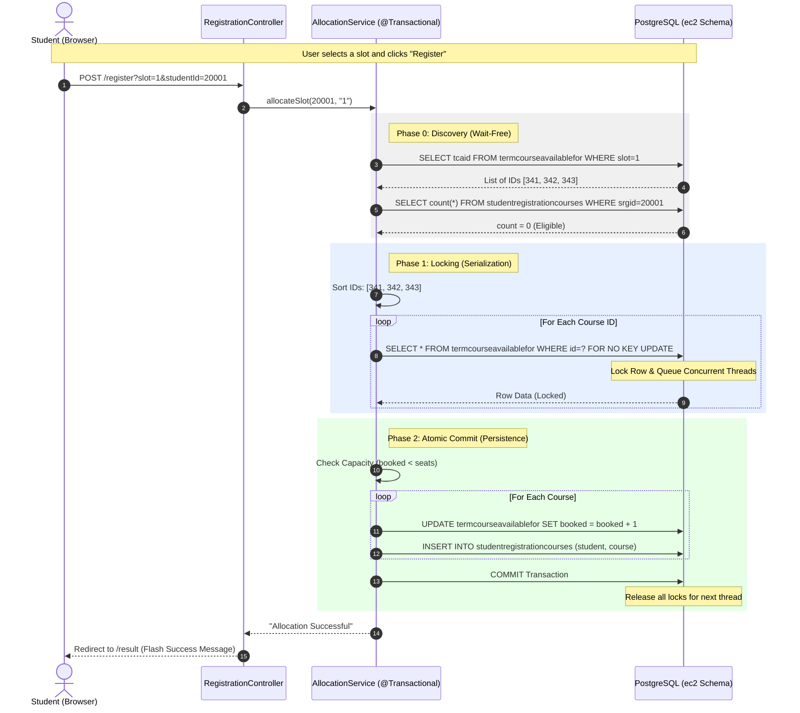

# Project Sequence Diagram: FCFS Subject Allocation

This diagram illustrates the end-to-end flow of a subject registration request, highlighting the three-phase concurrency control mechanism.

```mermaid
sequenceDiagram
    autonumber
    actor Student as Student (Browser)
    participant Ctrl as RegistrationController
    participant Svc as AllocationService (@Transactional)
    participant DB as PostgreSQL (ec2 Schema)

    Note over Student, DB: User selects a slot and clicks "Register"

    Student->>Ctrl: POST /register?slot=1&studentId=20001
    Ctrl->>Svc: allocateSlot(20001, "1")
    
    rect rgb(240, 240, 240)
        Note right of Svc: Phase 0: Discovery (Wait-Free)
        Svc->>DB: SELECT tcaid FROM termcourseavailablefor WHERE slot=1
        DB-->>Svc: List of IDs [341, 342, 343]
        Svc->>DB: SELECT count(*) FROM studentregistrationcourses WHERE srgid=20001
        DB-->>Svc: count = 0 (Eligible)
    end

    rect rgb(230, 240, 255)
        Note right of Svc: Phase 1: Locking (Serialization)
        Svc->>Svc: Sort IDs: [341, 342, 343]
        loop For Each Course ID
            Svc->>DB: SELECT * FROM termcourseavailablefor WHERE id=? FOR NO KEY UPDATE
            Note over DB: Lock Row & Queue Concurrent Threads
            DB-->>Svc: Row Data (Locked)
        end
    end

    rect rgb(230, 255, 230)
        Note right of Svc: Phase 2: Atomic Commit (Persistence)
        Svc->>Svc: Check Capacity (booked < seats)
        loop For Each Course
            Svc->>DB: UPDATE termcourseavailablefor SET booked = booked + 1
            Svc->>DB: INSERT INTO studentregistrationcourses (student, course)
        end
        Svc->>DB: COMMIT Transaction
        Note over DB: Release all locks for next thread
    end

    Svc-->>Ctrl: "Allocation Successful"
    Ctrl-->>Student: Redirect to /result (Flash Success Message)
```
